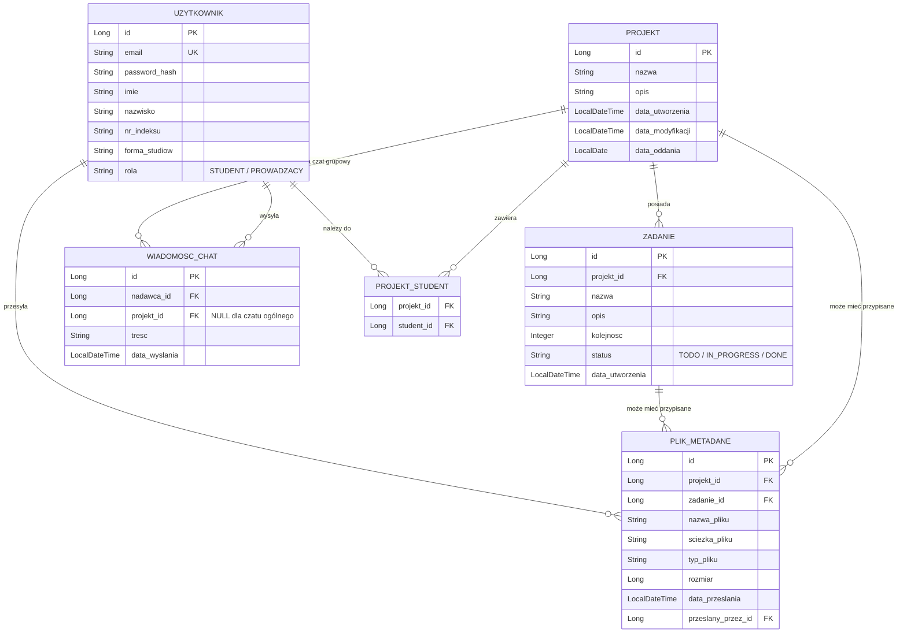

# Plan Implementacji: Aplikacja do zarządzania projektami studenckimi (ZwinneProject)

Niniejszy dokument przedstawia szczegółowy plan implementacji kompletnego systemu do zarządzania projektami studenckimi na uczelni. System składa się z istniejącego frontendu (React + TS + Vite) oraz nowo tworzonego backendu (Spring Boot + Gradle + PostgreSQL).

---

## Wybrane i Uzgodnione Technologie

Na podstawie przeprowadzonych ustaleń z użytkownikiem, w systemie zostaną zastosowane następujące rozwiązania:
- **Baza danych**: PostgreSQL (wersja deweloperska/produkcyjna w Dockerze), H2 w pamięci (profil testowy).
- **Konteneryzacja**: Docker oraz `docker-compose` do łatwego uruchamiania bazy, backendu i frontendu.
- **Komunikacja & API**: Standardowe REST API oraz WebSocket (STOMP) do obsługi czatu publicznego i grupowego.
- **Bezpieczeństwo**: Spring Security z obsługą Basic Auth (wstępnie) oraz pełnego JWT (AccessToken + RefreshToken).
- **Zapis plików**: Przechowywanie plików na dysku serwera w dedykowanym katalogu (montowanym jako wolumen w Dockerze) z zapisem metadanych w bazie PostgreSQL.

---

## Projekt Architektury Backendowej (Spring Boot + Gradle)

Backend zostanie umieszczony w nowym katalogu `ZwinneBackEnd` w katalogu głównym projektu: [ZwinneBackEnd](file:///home/teapocik/Documents/PBS/Progzwinne/ZwinneBackEnd).

### Struktura pakietów (`pl.edu.pbs.zwinnebackend`)

- `config/` - konfiguracje Springa (Security, WebMvc/CORS, WebSocket/STOMP, Uploads).
- `model/` - encje JPA (`Uzytkownik`, `Projekt`, `Zadanie`, `PlikMetadane`, `WiadomoscChat`).
- `repository/` - repozytoria Spring Data JPA.
- `service/` - logika biznesowa (`ProjektService`, `UserService`, `ZadanieService`, `FileStorageService`, `ChatService`).
- `controller/` - kontrolery REST oraz WebSocket (`AuthController`, `ProjektController`, `ZadanieController`, `StudentController`, `FileController`, `ChatWebSocketController`).
- `dto/` - obiekty transferu danych (DTO) dla requestów/responswów, w tym obsługa JWT i GraphQL-like DTO.
- `security/` - komponenty JWT (`JwtTokenProvider`, `JwtAuthenticationFilter`, `CustomUserDetailsService`, `UserPrincipal`).
- `exception/` - globalna obsługa błędów (`GlobalExceptionHandler`, dedykowane klasy wyjątków).

---

## Schemat Bazy Danych (PostgreSQL / H2)

---

## Szczegółowy Plan Implementacji Krok po Kroku

### Krok 1: Inicjalizacja i konfiguracja projektu Backend
1. Wygenerowanie projektu Spring Boot 3.x z użyciem Gradle, Java 21.
2. Dodanie zależności w `build.gradle`:
   - `spring-boot-starter-web`
   - `spring-boot-starter-data-jpa`
   - `spring-boot-starter-security`
   - `spring-boot-starter-websocket`
   - `spring-boot-starter-validation`
   - `postgresql` (runtime)
   - `h2` (test)
   - `jjwt-api`, `jjwt-impl`, `jjwt-jackson` (do obsługi tokenów JWT)
   - `lombok` (dla uproszczenia kodu encji i DTO)
3. Utworzenie struktury pakietów oraz konfiguracji `application.properties` i `application-test.properties` (dla profilu testowego H2).
4. Konfiguracja logowania (SLF4J + Logback) za pomocą pliku `logback-spring.xml` (rotacja plików logów, logowanie do konsoli i plików).

### Krok 2: Model danych i Repozytoria (JPA)
1. Implementacja encji JPA: `Uzytkownik`, `Projekt`, `Zadanie`, `PlikMetadane`, `WiadomoscChat`.
2. Zdefiniowanie relacji (Many-to-Many między projektami i studentami, One-to-Many dla zadań, plików i wiadomości).
3. Stworzenie odpowiednich repozytoriów Spring Data JPA rozszerzających `JpaRepository` wraz z obsługą paginacji i wyszukiwania (np. `Page<Projekt> findByNazwaContainingIgnoreCase(String nazwa, Pageable pageable)`).

### Krok 3: Zabezpieczenia (Spring Security + JWT)
1. Utworzenie enuma `Rola` ze standardowymi wartościami: `ROLE_STUDENT`, `ROLE_PROWADZACY`.
2. Implementacja mechanizmu rejestracji i logowania:
   - Endpoint `/api/auth/register` - rejestracja studenta lub prowadzącego. Przy rejestracji prowadzącego wymagana jest walidacja klucza rejestracji (np. parametr `lecturerKey` zgodny z właściwością `app.security.lecturer-key` zapisaną w konfiguracji backendu).
   - Endpoint `/api/auth/login` - autoryzacja za pomocą adresu e-mail i hasła. Zwraca AccessToken (np. ważny 15 minut) oraz RefreshToken (np. ważny 7 dni, zapisywany w bazie danych oraz zwracany w bezpiecznym ciasteczku `HttpOnly`).
   - Endpoint `/api/auth/refresh` - odświeżanie AccessTokena na podstawie RefreshTokena.
3. Konfiguracja `JwtAuthenticationFilter` w celu wyciągania tokena JWT z nagłówka `Authorization: Bearer <token>` i uwierzytelniania kontekstu bezpieczeństwa użytkownika.
4. Zabezpieczenie ścieżek w `SecurityConfig` za pomocą metod adnotowanych `@PreAuthorize` (np. `@PreAuthorize("hasRole('PROWADZACY')")` dla tworzenia i usuwania projektów oraz przypisywania studentów).

### Krok 4: Usługi i Kontrolery REST (Projekt, Zadania, Studenci)
1. **Zarządzanie projektami** (`/api/projects`):
   - `GET /api/projects` - lista projektów z obsługą stronicowania, filtrowania po nazwie i sortowania. Prowadzący widzi wszystkie projekty, student widzi tylko te, do których jest przypisany.
   - `GET /api/projects/{id}` - szczegóły konkretnego projektu.
   - `POST /api/projects` - tworzenie projektu (tylko Prowadzący).
   - `PUT /api/projects/{id}` - modyfikacja (tylko Prowadzący).
   - `DELETE /api/projects/{id}` - usuwanie projektu (tylko Prowadzący).
2. **Zarządzanie zadaniami** (`/api/projects/{projectId}/tasks`):
   - `GET /api/projects/{projectId}/tasks` - lista zadań projektu.
   - `POST /api/projects/{projectId}/tasks` - dodanie nowego zadania.
   - `PUT /api/projects/{projectId}/tasks/{taskId}` - modyfikacja statusu lub opisu zadania (Studenci przypisani do projektu mogą edytować statusy, Prowadzący ma pełny dostęp).
3. **Zarządzanie studentami**:
   - `GET /api/students` - lista wszystkich studentów (dla prowadzącego).
   - `POST /api/projects/{projectId}/students` - przypisanie studenta do projektu.

### Krok 5: Przesyłanie i pobieranie plików
1. Konfiguracja `FileStorageService` obsługującego zapis i odczyt z dedykowanego katalogu (np. `${app.upload.dir:/var/uploads}`).
2. Zabezpieczenie przed atakami Path Traversal (czyszczenie i walidacja nazw plików).
3. Implementacja endpointów:
   - `POST /api/projects/{projectId}/files` (opcjonalnie z parametrem `taskId`) - przesyłanie pliku.
   - `GET /api/files/{fileId}` - pobieranie pliku (streaming danych do strumienia odpowiedzi REST z odpowiednimi nagłówkami MIME).
   - `DELETE /api/files/{fileId}` - usuwanie pliku.

### Krok 6: Chat na WebSockets (STOMP)
1. Konfiguracja WebSocket w `WebSocketConfig` rejestrująca endpoint `/ws` (z włączonym CORS) oraz broker wiadomości STOMP.
2. Zabezpieczenie kanału WebSocket - autoryzacja połączenia na podstawie tokenu JWT przekazywanego w nagłówku połączenia STOMP (obsługa w `ChannelInterceptor`).
3. Stworzenie kontrolera czatu:
   - `/app/chat.send` -> rozsyłanie wiadomości publicznych na `/topic/public`.
   - `/app/chat.sendToProject/{projectId}` -> walidacja, czy użytkownik należy do projektu, a następnie rozsyłanie wiadomości na kanał `/topic/project/{projectId}`.
4. Zapisywanie historii wiadomości w bazie danych w celu załadowania jej przy otwarciu okna czatu.

### Krok 7: Dostosowanie Frontendu (React)
1. **Autoryzacja**:
   - Zastąpienie mockowanego logowania w [page.tsx](file:///home/teapocik/Documents/PBS/Progzwinne/ReactAppAgileTeam/ZwinneFrontEnd/src/LoginPage/components/page.tsx) oraz rejestracji w [register.tsx](file:///home/teapocik/Documents/PBS/Progzwinne/ReactAppAgileTeam/ZwinneFrontEnd/src/RegisterPage/components/register.tsx) żądaniami HTTP POST do backendu.
   - Zapisywanie otrzymanego AccessTokena w pamięci aplikacji (np. stan React/Context) oraz RefreshTokena w bezpieczny sposób.
   - Dodanie interceptora HTTP (np. w `backendConnection.tsx` lub poprzez pomocniczą funkcję fetch), który automatycznie dołącza nagłówek `Authorization: Bearer <token>` do każdego zapytania i obsługuje odświeżanie tokena przy statusie 401.
2. **Paginacja i Filtrowanie**:
   - Zaimplementowanie w widoku głównym [Main.tsx](file:///home/teapocik/Documents/PBS/Progzwinne/ReactAppAgileTeam/ZwinneFrontEnd/src/MainPage/components/main.tsx) wywołań API uwzględniających parametry `page`, `size`, `sort` oraz `searchQuery`. Dodanie przycisków sterowania stronami.
3. **Czat (UI)**:
   - Integracja biblioteki klienckiej WebSocket i STOMP (np. `@stomp/stompjs` lub natywnego WebSocketu, jeśli to konieczne).
   - Stworzenie widoku czatu grupowego i ogólnego w aplikacji klienckiej, umożliwiającego wysyłanie wiadomości tekstowych w czasie rzeczywistym.
4. **Zarządzanie Plikami**:
   - Dodanie do widoku projektu/zadań formularza do przesyłania plików (kontrolka `<input type="file" />`) i listy załączników z możliwością ich pobierania.

### Krok 8: Konteneryzacja (Docker)
1. Utworzenie `Dockerfile` dla backendu (Spring Boot):
   - Multi-stage build (pierwszy etap: kompilacja za pomocą obrazu `gradle:jdk21-alpine`, drugi etap: uruchomienie z lekkiego obrazu `eclipse-temurin:21-jre-alpine`).
2. Utworzenie `Dockerfile` dla frontendu (React):
   - Budowanie aplikacji produkcyjnej Vite i serwowanie jej za pomocą serwera Nginx.
3. Utworzenie `docker-compose.yml` w głównym katalogu, który definiuje trzy usługi:
   - `db`: baza PostgreSQL z trwałym wolumenem.
   - `backend`: aplikacja Spring Boot, zależna od `db`, z zamontowanym wolumenem na przesyłane pliki.
   - `frontend`: aplikacja React/Nginx.

---

## Plan Weryfikacji i Testowania

### Testy Automatyczne (Backend)
Będą uruchamiane lokalnie za pomocą polecenia `./gradlew test` w katalogu `ZwinneBackEnd`.
1. **Testy jednostkowe**:
   - Testy walidacji reguł biznesowych w serwisach (np. `ProjektServiceTest`, `UserServiceTest`) przy użyciu biblioteki **Mockito** do mockowania repozytoriów.
2. **Testy integracyjne**:
   - Testy kontrolerów REST przy użyciu **MockMVC** i bazy **H2** w pamięci.
   - Testy autoryzacji: weryfikacja, czy użytkownicy bez roli `PROWADZACY` nie mogą dodawać ani usuwać projektów (oczekiwany kod błędu HTTP 403 Forbidden).
   - Testy rejestracji i poprawnego generowania JWT.

### Testy Manualne (E2E)
1. Uruchomienie całego środowiska za pomocą `docker-compose up --build`.
2. Rejestracja studenta i prowadzącego (z kluczem autoryzacyjnym).
3. Logowanie i weryfikacja poprawności generowania tokenów.
4. Utworzenie projektu przez prowadzącego, przypisanie studenta, dodanie zadań, zmiana statusów zadań przez studenta.
5. Przesłanie plików (np. dokumentacji projektu w formacie PDF) i ich pobranie.
6. Przetestowanie czatu w dwóch różnych oknach przeglądarki (czas rzeczywisty).
